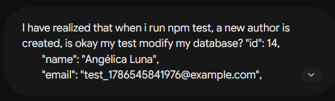

# Miniblog API

## Descripción del proyecto
Este proyecto es una API RESTful desarrollada en Node.js + Express + PostgreSQL para la gestión de un miniblog, organizando los módulos de authors y posts mediante una arquitectura modular que separa rutas, controladores, servicios y validadores.

## Demo en producción

* **Link del deployment en Railway:** [Ver aplicación en vivo](https://miniblog-projectm2-production.up.railway.app/)
* **Link de la documentación en OpenAPI:** [Ver documentación de la API](https://miniblog-projectm2-production.up.railway.app/api-docs/)

## Estructura del proyecto
```text
miniblog-projectM2-main/
├── .env.example
├── .gitignore
├── openapi.yaml
├── package.json
├── package-lock.json
├── vitest.config.js
├── src/
│   ├── app.js
│   ├── server.js
│   ├── config/
│   │   ├── db-test-connection.js
│   │   ├── db.js
│   │   ├── seed.sql
│   │   └── setup.sql
│   ├── controllers/
│   │   ├── authorController.js
│   │   └── postController.js
│   ├── middlewares/
│   │   └── errorHandler.js
│   ├── routes/
│   │   ├── authorRoutes.js
│   │   └── postRoutes.js
│   ├── services/
│   │   ├── authorService.js
│   │   └── postService.js
│   └── utils/
│       ├── errors.js
│       └── validators.js
└── tests/
    ├── app.test.js
    └── validators.test.js

```

## Requisitos previos

* Node.js >= 18
* PostgreSQL >= 14
* npm >= 9

## Ejecución local

### 1. Clonar e instalar dependencias

```bash
git clone [https://github.com/angelicalunagar/miniblog-projectM2.git](https://github.com/angelicalunagar/miniblog-projectM2.git)
cd miniblog-projectM2
npm install

```

### 2. Configuración de la base de datos

1. Crear la base de datos:
```bash
createdb miniblog

```


2. Ejecutar el script de setup:
```bash
psql miniblog -f src/config/setup.sql

```


3. Cargar datos de ejemplo:
```bash
psql miniblog -f src/config/seed.sql

```


### 3. Configurar las variables de entorno

Crear un archivo `.env` tomando como referencia el archivo `.env.example`:

```env
PORT=3000
DB_USER=postgres
DB_HOST=localhost
DB_PASSWORD=a_password
DB_NAME=miniblog
DB_PORT=5432

```

### 4. Ejecución local y tests

```bash
npm run dev     # Modo desarrollo
npm start       # Modo producción
npm test        # Modo testing

```

La API estará disponible en `http://localhost:3000`.

## Documentación OpenAPI

La documentación de la API está definida en el archivo `openapi.yaml`, el cual se encuentra en la raíz del proyecto.
Para visualizarla, puedes:

* Copiar el contenido de `openapi.yaml` en el [Swagger Editor](https://editor.swagger.io/).
* O utilizar una extensión de VS Code como "Swagger Viewer".

## Endpoints de la API

La API expone las siguientes rutas RESTful:

### Autores (`/authors`)

* **GET `/authors**`: Obtiene la lista de todos los autores registrados.


* **POST `/authors**`: Crea un nuevo autor en el sistema.


* **GET `/authors/{id}**`: Obtiene los detalles de un autor específico mediante su ID.


* **PUT `/authors/{id}**`: Actualiza la información de un autor existente.


* **DELETE `/authors/{id}**`: Elimina un autor del sistema.


### Publicaciones (`/posts`)

* **GET `/posts**`: Obtiene la lista completa de todas las publicaciones.


* **POST `/posts**`: Crea una nueva publicación.


* **GET `/posts/{id}**`: Consulta el detalle de una publicación específica por su ID.


* **PUT `/posts/{id}**`: Actualiza el contenido o los datos de una publicación existente.


* **DELETE `/posts/{id}**`: Elimina una publicación del miniblog.


## Deploy en Railway

### Pasos

1. Crear cuenta en Railway y conectar el repo de GitHub.
2. Crear un nuevo proyecto → "Deploy from GitHub repo".
3. Agregar un plugin de PostgreSQL al proyecto.
4. En la sección **Variables** del servicio Node, agregar:

| Variable | Valor |
| :--- | :--- |
| `DATABASE_URL` | `${{Postgres.DATABASE_URL}}` (internal URL) |
| `NODE_ENV` | `production` |
| `PORT` | Railway lo inyecta automáticamente |

5. Railway detectará el `package.json` y usará `npm start` como comando de inicio.
6. Correr el script de setup desde la terminal de Railway o desde tu máquina apuntando a la URL pública:

```bash
psql <DATABASE_PUBLIC_URL> -f src/config/setup.sql
psql <DATABASE_PUBLIC_URL> -f src/config/seed.sql

```

7. La app quedará disponible en la URL pública generada por Railway (ej. `https://miniblog-projectm2-production.up.railway.app/`).


## Registro del uso de AI

Durante el desarrollo del proyecto se utilizó Gemini Flash-Lite Extended como herramienta de apoyo para:
* Comprender conceptos de Express, PostgreSQL y consultas SQL.
* Resolver dudas durante la implementación de los endpoints CRUD.
* Generar y revisar código.
* Elaborar la documentación del proyecto (README y Swagger/OpenAPI).

*Todas las respuestas fueron analizadas, adaptadas y verificadas antes de incorporarlas al proyecto.*

### Ejemplos de prompts utilizados

* **Prompt:**


